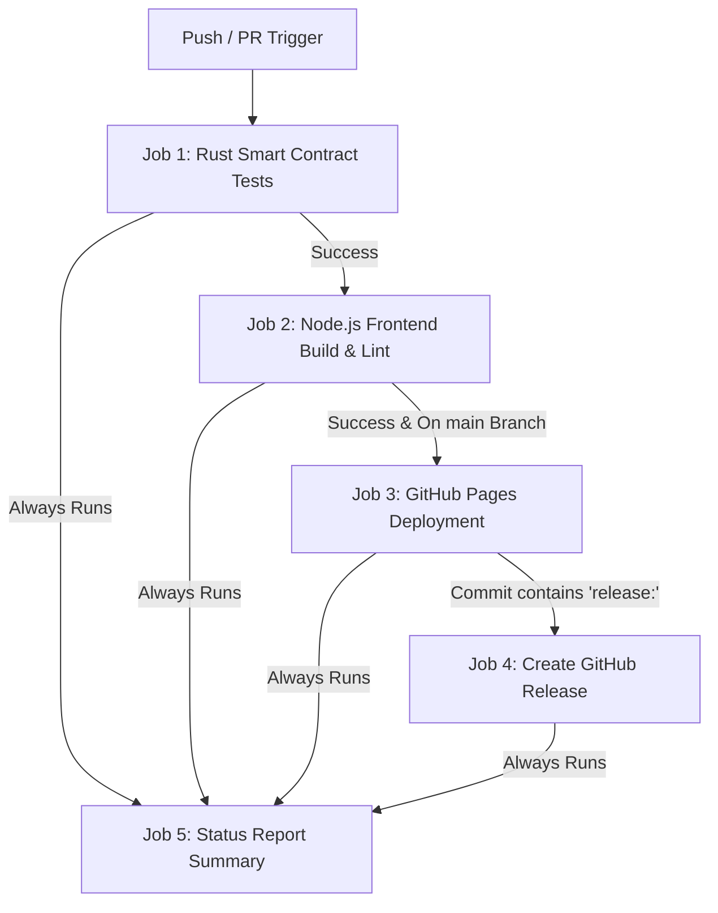

# RentStar CI/CD Pipeline Setup Guide

This guide details the steps required to configure, secure, and troubleshoot the automated CI/CD pipeline for the RentStar roommate settlement application. By following these steps, you will enable automatic smart contract testing, frontend verification, GitHub Pages deployment, and release generation.

---

## 1. Enabling GitHub Pages via Actions

By default, GitHub Pages is configured to build from a branch. To allow our CI/CD pipeline to deploy the site, you must update the source setting:

1. Navigate to your repository on GitHub: `https://github.com/king3192/steller-level-3`.
2. Click on the **Settings** tab in the top navigation bar.
3. In the left sidebar, click on **Pages** (under the "Code and automation" section).
4. Under **Build and deployment** -> **Source**, select **GitHub Actions** from the dropdown menu.
5. The page will save automatically. You are now configured to deploy via the workflow!

---

## 2. Configuring Workflow Permissions

Our pipeline needs write access to publish build artifacts to GitHub Pages and to create official GitHub Releases.

1. In your repository settings, click on **Actions** in the left sidebar, then select **General**.
2. Scroll down to the **Workflow permissions** section.
3. Select **Read and write permissions**.
4. Check the box for **Allow GitHub Actions to create and approve pull requests** (if applicable).
5. Click the **Save** button.

---

## 3. Environment Setup & Secret Variables

The React frontend relies on several environment variables for communicating with the Stellar network. These variables are built into the production build bundle.

### Network Variables Supported
The workflow supports injecting the following environment variables during the build process:
- `VITE_CONTRACT_ID`: The deployed RentSplit contract address.
- `VITE_ROOM_MANAGER_CONTRACT_ID`: The deployed RoomManager contract address.
- `VITE_SOROBAN_RPC_URL`: The Stellar RPC endpoint (e.g., `https://soroban-testnet.stellar.org`).
- `VITE_HORIZON_URL`: The Stellar Horizon API endpoint (e.g., `https://horizon-testnet.stellar.org`).
- `VITE_NETWORK_PASSPHRASE`: The Stellar network passphrase (e.g., `Test SDF Network ; September 2015`).

### Staging vs. Production Setup
To handle multiple environments (e.g., Staging vs. Production), you can set up GitHub Environments:
1. In repository settings, click **Environments** -> **New environment**.
2. Create environments named `github-pages` (default for Pages) and/or `production`.
3. Add environment-specific secrets or configuration variables there if you want to customize values per deployment target.

---

## 4. Branch Protection Rules

To protect your production and development code, establish branch protection rules for the `main` and `develop` branches:

1. In repository settings, click **Branches** in the left sidebar.
2. Under **Branch protection rules**, click **Add protection rule**.
3. Set the **Branch name pattern** to `main` (and repeat for `develop`).
4. Enable the following protections:
   - **Require a pull request before merging**: This ensures all changes go through a code review.
   - **Require status checks to pass before merging**: Check this box and search for your status check names (`Test Smart Contracts` and `Build React Frontend`). This prevents merging broken code.
5. Click **Create** at the bottom of the page.

---

## 5. How the Pipeline Works

The pipeline is split into distinct logical blocks to guarantee speed, safety, and correctness.

1. **Smart Contract Testing (`test-contracts`)**: Spawns an Ubuntu container, installs the Rust toolchain, targets WebAssembly (`wasm32-unknown-unknown`), caches Rust dependencies using `actions/cache`, runs `cargo test` for `room_manager` and `rent_split`, and compiles WebAssembly binaries.
2. **Frontend Build & Validation (`build-frontend`)**: Sets up Node.js 18.x, runs clean dependency installs using `npm ci` (restoring caches for npm packages), runs ESLint code quality checks, compiles Vite production bundle, and uploads the compiled bundle as a secure artifact.
3. **GitHub Pages Deployment (`deploy-pages`)**: Runs only on pushes/releases to `main`. It downloads the compiled artifact, configures Pages, uploads files, and completes the deployment.
4. **Release Creation (`release`)**: Runs on pushes to `main` when the commit message starts with `release:`. It uses the GitHub CLI to create a new release tag `v{run_number}` with deployment metadata and URL.
5. **Status Report (`status-report`)**: Compiles all job outcomes and prints a structured markdown summary directly onto the Actions run dashboard page.

---

## 6. Accessing Your Live URL

Once the pipeline runs successfully, your application is available at:
`https://king3192.github.io/steller-level-3/`

You can monitor the deployment status by looking at the right-hand panel of your GitHub repository under the **Deployments** section. Click on the green status indicator to see past deployments and jump directly to the live URL.

---

## 7. Security Best Practices

- **Never Commit Secrets**: Do not write contract deployer secret keys, seed phrases, or private RPC keys into your `.env` or YAML files.
- **Strict Actions Permissions**: Keep Action workflow permissions restricted. The `ci.yml` file uses granular `permissions` declarations at the job level (e.g. `pages: write`, `id-token: write`) to ensure no job can abuse the GitHub token.
- **Pin Action Versions**: We pin our third-party action steps using verified major versions (e.g. `actions/checkout@v4`, `actions/setup-node@v4`) to defend against supply chain attacks.

---

## 8. Troubleshooting & Common Issues

| Problem | Cause | Solution |
| :--- | :--- | :--- |
| **Pages Deploy fails with 403 / Permission Denied** | Workflow permissions are restricted to Read-Only. | Go to Settings -> Actions -> General. Change Workflow permissions to **Read and write permissions**. |
| **Rust compile fails with "target wasm32 not found"** | Rust toolchain did not install the target during setup. | Ensure `dtolnay/rust-toolchain` includes `targets: wasm32-unknown-unknown`. |
| **Vite build fails on eslint warnings** | Vite treats warnings as errors in some environments. | ESLint uses `|| echo` to prevent warning blocks in CI, and Vite drops logs automatically. Double-check your local `eslint.config.js` configuration. |
| **No "Deployments" section appears on GitHub** | GitHub Pages deployment has never run, or Source is not set to "GitHub Actions". | Ensure the first push to `main` runs successfully and Pages source is changed to GitHub Actions. |
| **Release creation fails with "Resource not accessible by integration"** | The GITHUB_TOKEN lacks write permission. | Update Workflow permissions in Settings -> Actions -> General to **Read and write**. |
