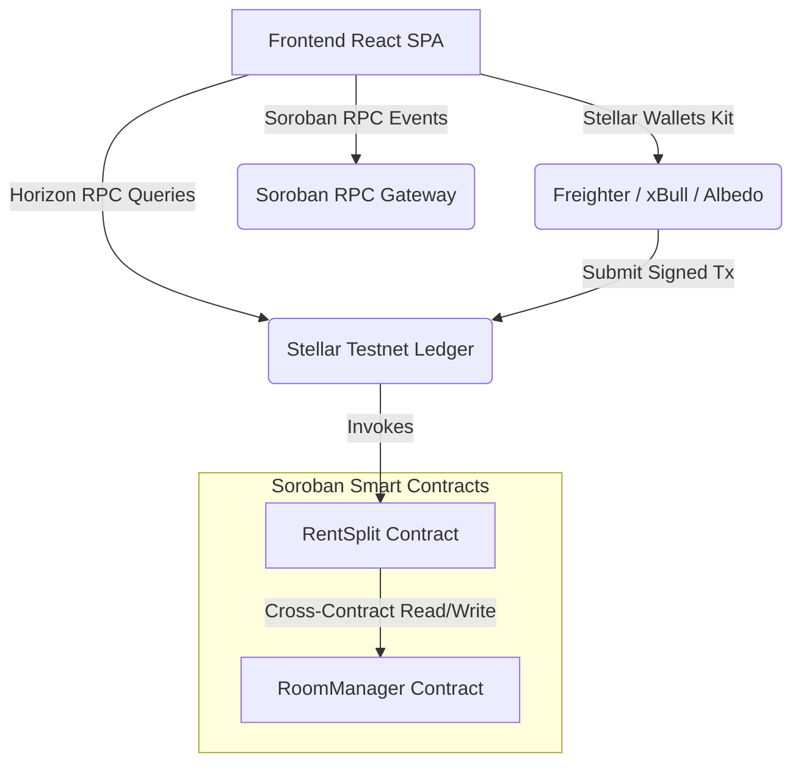

# RentStar - System Architecture

RentStar is a decentralized apartment rent settlement application built on the Stellar Network, utilizing Soroban Rust Smart Contracts for trustless allocation and collection of rent.

---

## 🏗️ System Overview

The system consists of three main blocks:
1. **Frontend Client**: React Single Page Application (SPA) styled with Tailwind CSS, providing dashboards for Landlords and Roommates.
2. **Soroban Smart Contracts**: Two communicating contracts deployed on Stellar Testnet that manage access, roommate registers, and rent pools.
3. **Stellar Network Gateways**: Horizon and Soroban RPC nodes for blockchain state queries, transaction submissions, and event listening.

---

## 1. Frontend Architecture

The frontend is a lightweight, responsive React 18 application built on Vite. It uses a custom hooks-based architecture to isolate contract interactions and wallet state:

- **State Orchestration**: Managed in `App.jsx`, which routes tabs (`Smart Contract Rent`, `Direct XLM`, `Landlord Panel`) and synchronizes user profiles.
- **Wallet Connection**: The `useWalletKit` hook wraps the `@creit.tech/stellar-wallets-kit`, managing the UI modal and active connection status.
- **Contract Read Hook**: `useRoomManager` and `usePayRent` handle transaction simulation, parameter serializing, XDR decoding, and state-machine transitions (`building` -> `signing` -> `submitting` -> `pending` -> `success/error`).

---

## 2. RoomManager Contract

The `RoomManager` contract serves as the source of truth for roommate profiles, rent shares, and balance ledgers.

- **Storage Structure**:
  - `Landlord`: The administrator account.
  - `Roommate List`: Array of active roommate addresses.
  - `Roommate Share`: Map from address to required rent (in XLM).
  - `Roommate Paid`: Map from address to cumulative paid rent (in XLM).
  - `RentSplit Address`: The linked payment contract authorized to invoke modifications on roommate balances.
- **Access Control**:
  - Functions like `add_roommate` and `set_rent_split` require the landlord's cryptographic signature (`require_auth()`).
  - Balance update functions are restricted to calls coming from the registered `RentSplit` contract ID.

---

## 3. RentSplit Contract

The `RentSplit` contract acts as the payment collector. It processes roommates' rent contributions and verifies transaction constraints.

- **Cross-Contract Communication**:
  - When a roommate submits a payment, `RentSplit` calls `RoomManager.is_roommate(payer)` to verify if the address is registered.
  - It fetches the roommate's remaining share by calling `RoomManager.get_roommate_balance(payer)`.
  - Upon validating the payment amount against outstanding rent, it securely registers the contribution and triggers `RoomManager.record_payment(payer, amount)` via a cross-contract call.
- **Rent Accumulation**:
  - XLM funds are held inside the `RentSplit` token balance until the pool is settled.

---

## 4. Wallet Integrations

RentStar integrates `@creit.tech/stellar-wallets-kit` to support standard browser wallets:
- **Freighter**: The official Stellar extension.
- **xBull**: Multi-chain, developer-friendly Stellar wallet.
- **Albedo**: Web-based key management.
- **Demo Mode**: Built-in testbed that mocks transaction building and signs events in-memory, enabling developers to preview landlord and roommate dashboards immediately without installing wallet extensions.

---

## 5. Event System

Soroban contracts emit structured events upon transaction finalization.
- **Listener Daemon**: The `useContractEvents.js` hook initiates polling of the Soroban RPC endpoint (`getEvents`) filter matching the contract ID.
- **XDR Decoders**: Decodes event topics and data attributes from base64 XDR formats into raw Javascript numbers and strings.
- **Activity Log**: Populates the UI's `Recent Rent Activity` feed in real-time, showing who paid, the amount, and links to Stellar Expert.
